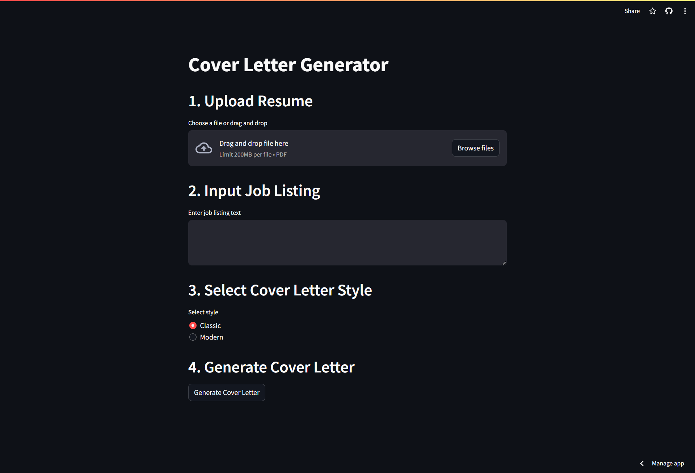
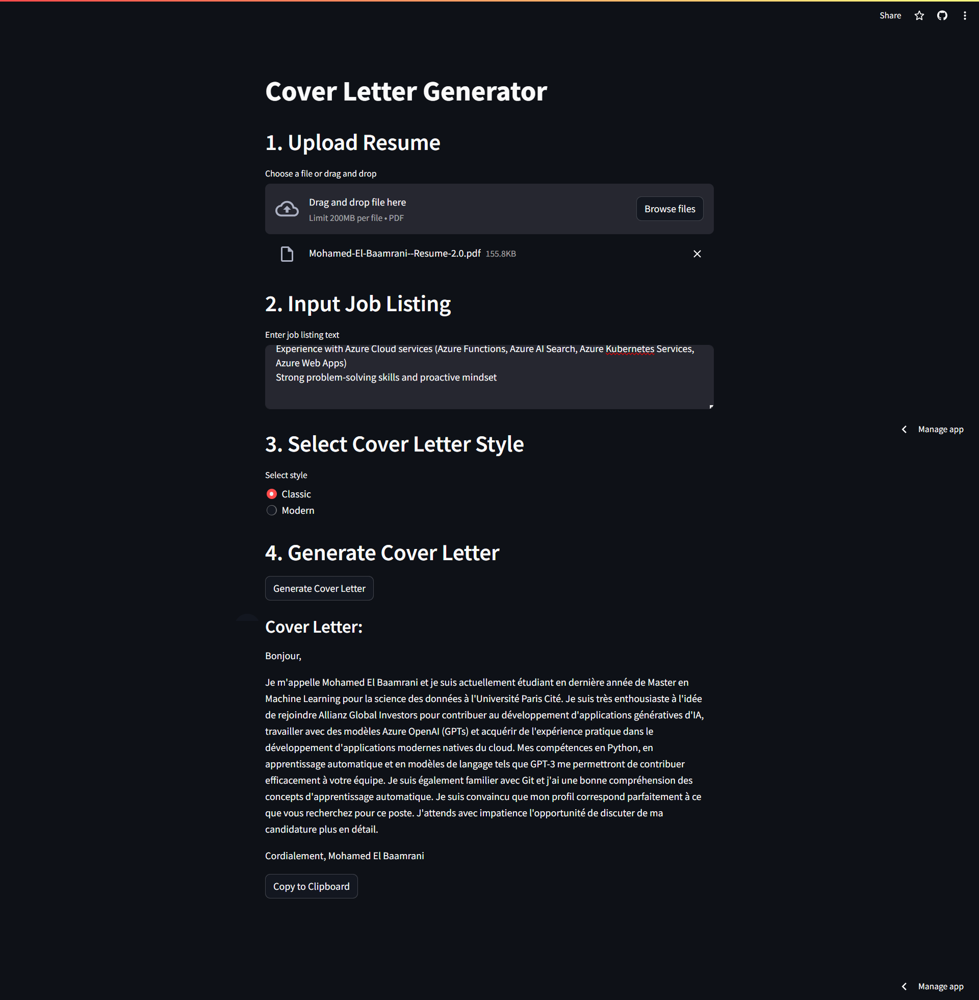
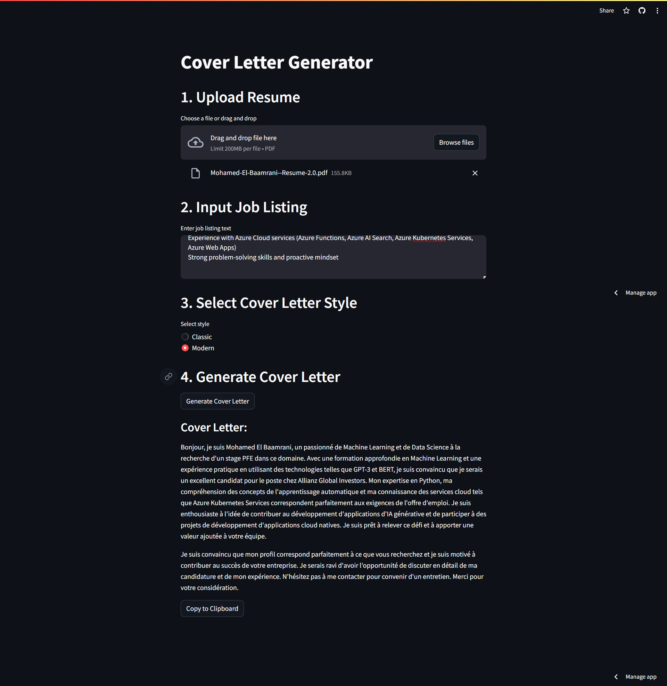

# Générateur de Lettres de Motivation avec LLm

## Introduction

Ce projet propose un générateur de lettres de motivation, exploitant la puissance de l'API ChatGPT d'OpenAI pour aider les utilisateurs à créer des lettres de motivation personnalisées et convaincantes pour leurs candidatures d'emploi.


## LLM utilisé
Le LLM utilisé est `gpt-3.5-turbo` pour sa rentabilité et ses capacités impressionnantes dans la gamme de prix donnée.  
Les modèles locaux ont été évités en raison d'un manque de ressources de calcul disponibles. Cependant, la conception à travers LangChain permet de passer facilement à des modèles alternatifs.
Le repo contient deux prompt principales, chacune conçue avec des instructions détaillées se concentrant sur un style différent de lettre de motivation. Ces prompts peuvent facilement être modifiées ou étendues pour inclure d'autres styles.

## Etapes

1. **Télécharger un CV:**
   - Permet à l'utilisateur de télécharger un CV au format PDF. Le CV est ensuite converti en texte à l'aide de la bibliothèque `pypdf2`.

2. **Input Job Listing:**
   - Permet à l'utilisateur de saisir le texte d'une offre d'emploi. .

3. **Sélecteur de style:**
   - Permet à l'utilisateur de sélectionner un style de lettre de motivation, en déterminant l'invite qui sera utilisée pour générer la lettre de motivation.
     - Le style "classique" est conçu pour être une lettre de motivation plus traditionnelle, avec une longueur et un ton appropriés.
     - Le style "moderne" est conçu pour être une lettre de motivation plus concise avec un ton plus décontracté.

4. **Générer une lettre de motivation:**
   - Génère une lettre de motivation basée sur le style sélectionné et sur le CV et l'offre d'emploi fournis. La lettre de motivation générée est affichée dans l'interface utilisateur et peut être facilement copiée dans le presse-papiers.
## Installation

### Prérequis

1. Python 3.9 ou version ultérieure.
2. pip et virtualenv.

## Étapes d'installation

### Install Dependencies
1. **Clonage du dépôt:** Clonez le dépôt GitHub sur votre machine locale pour commencer.

```bash
git clone https://github.com/medbm5/cover-letter-generator.git
cd cover-letter-generator
```

2. **Configuration de l'environnement virtuel:**

```bash
python -m venv cover-env
# Sur Windows
cover-env\Scripts\activate
# Sur Unix ou MacOS
source cover-env/bin/activate
```

3. **Installation des dépendances:**

 ```bash
pip install -r requirements.txt
```

4. **Configuration des variables d'environnement:**

```bash
echo "OPENAI_API_KEY=<your-openai-api-key>" >> .env
```


4. **Lancement de l'application:**

```bash
run streamlit run app.py
```

## Screenshots








## Déploiement

L'application est déployée avec Streamlit 
